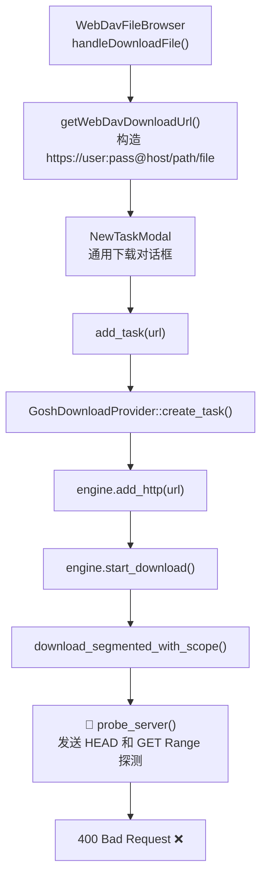

# WebDAV 下载 400 Bad Request 根因分析

## 错误信息
```
Network error: Both HEAD and GET Range probes failed 
(HEAD: "status 400 Bad Request", GET: "status 400 Bad Request")
```

## 错误发生的调用链



## 排除的原因

| 可能原因 | 状态 | 说明 |
|---------|------|------|
| Basic Auth Header 未设置 | ❌ 已排除 | [apply_basic_auth_if_present](file:///h:/VSCodeWork/PiDown/gosh-dl/src/http/segment.rs#L886) 在 HEAD 和 GET 请求中都正确调用了 |
| URL userinfo 泄入 Host header | ❌ 已排除 | reqwest/hyper 会按 RFC 规范正确剥离 userinfo |
| 凭据编码问题 | ❌ 已排除 | `Url::set_username/set_password` 的 percent-encoding 与 `urlencoding::decode` 兼容 |
| 路径双重编码 | ❌ 已排除 | PROPFIND 返回的 path 已 URL-decode，`download_webdav_file` 中重新 encode，无双重编码 |

## 最可能的根因

### 原因：probe_server 发送的 `Accept-Encoding: identity` 导致部分 WebDAV 服务器返回 400

[probe_server](file:///h:/VSCodeWork/PiDown/gosh-dl/src/http/segment.rs#L878-L955) 在每个请求中强制设置了：

```rust
// segment.rs L888
.header("Accept-Encoding", ACCEPT_ENCODING_IDENTITY)  // "identity"
```

某些 WebDAV 服务器（如 Alist、Cloudreve 等基于 Go 的服务端）对 `Accept-Encoding: identity` 头的处理不规范，会返回 400。这是因为 `identity` 虽然在 HTTP 规范中是合法的，但部分实现没有识别它。

> [!IMPORTANT]
> 但这个也不是最常见的原因。**如果你的 WebDAV 服务器是 Alist，最常见的 400 原因是：Alist 的某些存储后端（如 115、阿里云盘）在通过 WebDAV 暴露时，不支持 HEAD 请求也不支持 Range 请求，对这些请求直接返回 400。**

### 验证方法

请在终端运行以下命令，把 `USER`, `PASS`, `HOST`, `PATH` 替换为实际值：

```powershell
# 测试 1: HEAD 请求（模拟 probe_server 的第一步）
curl -v -I -u "USER:PASS" -H "Accept-Encoding: identity" "https://HOST/PATH/file.txt"

# 测试 2: GET Range 请求（模拟 probe_server 的 fallback）
curl -v -r 0-0 -u "USER:PASS" -H "Accept-Encoding: identity" "https://HOST/PATH/file.txt"

# 测试 3: 纯 GET 请求（不带 Range 和 Accept-Encoding）
curl -v -u "USER:PASS" "https://HOST/PATH/file.txt"
```

- 如果**测试 1 和 2 都返回 400**，但**测试 3 返回 200**：说明是 `Accept-Encoding: identity` 或 `Range` 头导致的
- 如果**测试 3 也返回 400**：说明是 URL/路径问题
- 如果**测试 3 返回 401**：说明是认证问题

## 修复方案

### 方案：在 probe_server 中增加不带 Range 的纯 GET fallback

当 HEAD 和 GET Range 都失败时，再尝试一次不带 `Range` 和 `Accept-Encoding: identity` 的纯 GET 请求作为最终 fallback。这样即使 WebDAV 服务器不支持 HEAD/Range，也能正常下载（退化为单连接下载）。

修改位置：[segment.rs probe_server](file:///h:/VSCodeWork/PiDown/gosh-dl/src/http/segment.rs#L878-L955)

```diff
     // Fallback to GET with Range: bytes=0-0 if HEAD failed
     let mut get_err = None;
     if !is_head_success {
         // ... existing Range GET code ...
     }

+    // Final fallback: plain GET without Range or Accept-Encoding: identity
+    // Some WebDAV servers (e.g., Alist backends) reject HEAD and Range requests
+    if resp.is_none() {
+        let mut req = crate::http::apply_basic_auth_if_present(client.get(url), url)
+            .header("User-Agent", user_agent);
+        if let Some(cookie_list) = cookies {
+            if !cookie_list.is_empty() {
+                req = req.header("Cookie", cookie_list.join("; "));
+            }
+        }
+        if let Some(ref_val) = referer {
+            req = req.header("Referer", ref_val);
+        }
+        match req.send().await {
+            Ok(r) => {
+                if r.status().is_success() {
+                    resp = Some(r);
+                }
+            }
+            Err(_) => {}
+        }
+    }

     let response = resp.ok_or_else(|| {
```

这样做的效果：
- ✅ 兼容不支持 HEAD/Range 的 WebDAV 服务器
- ✅ 退化为单连接下载（无 Range 支持时自动降级）
- ✅ 不影响正常 HTTP 服务器的多连接下载
